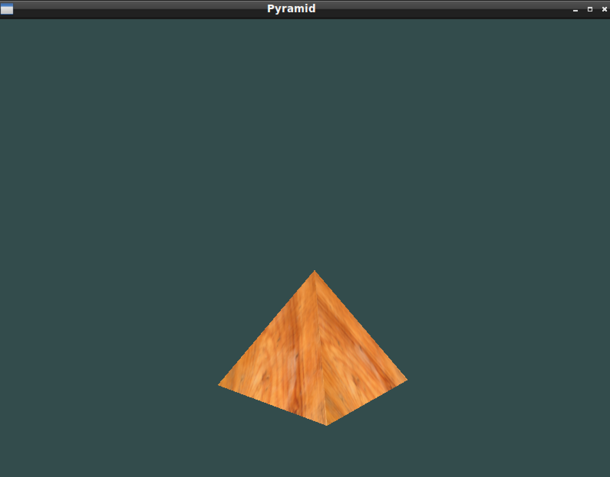
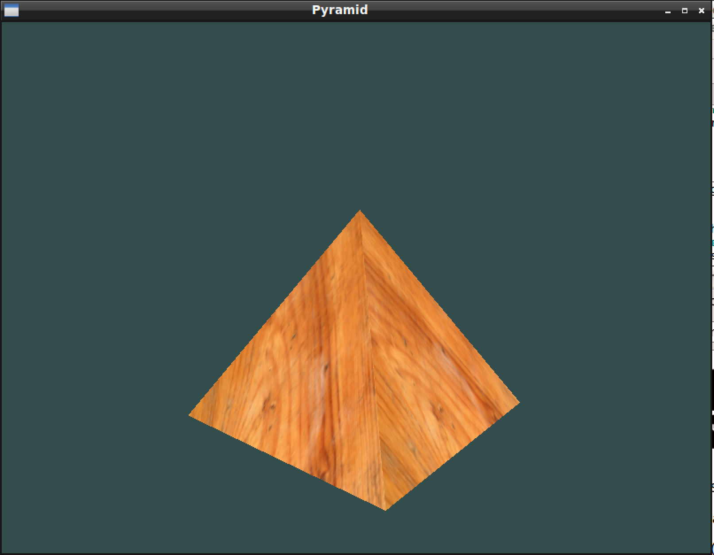
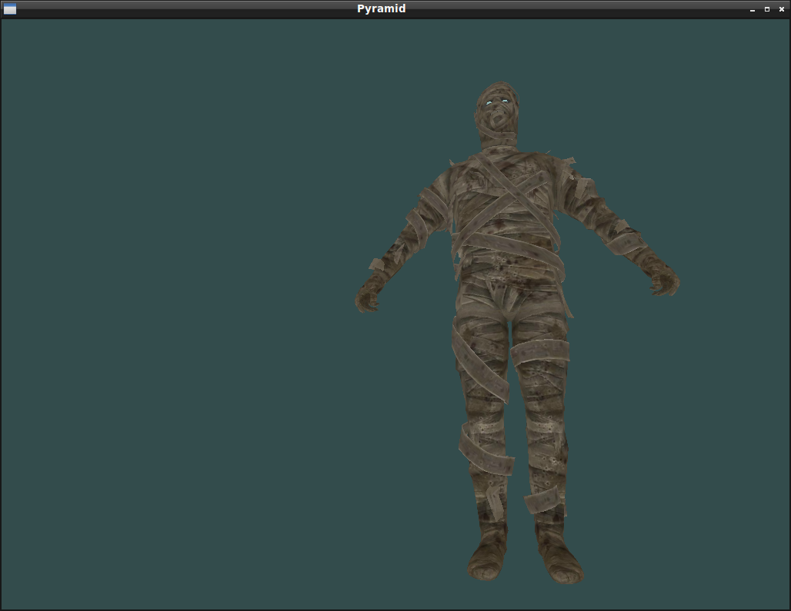

Setup
-----

The project has two dependencies : assimp and SOIL

To install assimp :
  * Download assimp v3.1.1 (the installator for 3.2 seems to be bugged) at http://www.assimp.org/main_downloads.html
  * Extract, open terminal in folder
  * cmake -G 'Unix Makefiles'
  * make
  * sudo make install

If the library was installed into /usr/local/lib, you may need to copy it into /usr/lib

 To install SOIL :
  * Download the latest SOIL version at http://www.lonesock.net/soil.html
  * Extract, open terminal in folder
  * Go to prokects/makefile
  * mv makefile Makefile
  * mkdir obj
  * make
  * sudo make install

For your convenience, copies of the above third party libraries are also available under the third_party_deps/ folder of this project.

## Images
### Pyramid Model 1

### Pyramid Model Close up

### Mummy Model loaded

## TODO
* Update pyramid texture to use more realistic bricks instead of the placeholder wooden texture.

## Apply textures in blender
* Make sure that you're in edit mode for the right hand pane so that when you press 'U', you can "unwrap" the texture.

## References
The following resources were consulted in the completion of this assignment:

* Example wooden texture (example_wood_texture.png): http://en.flossmanuals.net/blender/texturing/
* Example Bricks texture (bricks_texture.jpg) : https://www.google.com/imgres?imgurl=https%3A%2F%2Fs-media-cache-ak0.pinimg.com%2F564x%2F9c%2F86%2F14%2F9c8614ce279fa711b9c255e7cdaec509.jpg&imgrefurl=https%3A%2F%2Fwww.pinterest.com%2Fpin%2F225743000047618989%2F&docid=8z91Lw-Ii0AD2M&tbnid=5j4JOEY0bl_GbM%3A&w=564&h=752&bih=732&biw=1439&ved=0ahUKEwivq5CJ9KHOAhVB-mMKHYdgBZ8QMwhDKBAwEA&iact=mrc&uact=8
* How to apply textures in blender: https://www.youtube.com/watch?v=6gRUUeFteQg
* Project starter code with model loading: http://www.learnopengl.com/#!Model-Loading/Model
* Directional lighting / Spot lighting tutorial: http://www.tomdalling.com/blog/modern-opengl/08-even-more-lighting-directional-lights-spotlights-multiple-lights/
* Egypt mummy model: https://www.yobi3d.com/v/fxSiYKDNWJ/mummy.obj/3d%20model%20free%20mummy
* Small mummy model: http://leopoly.com/view/?id=30868